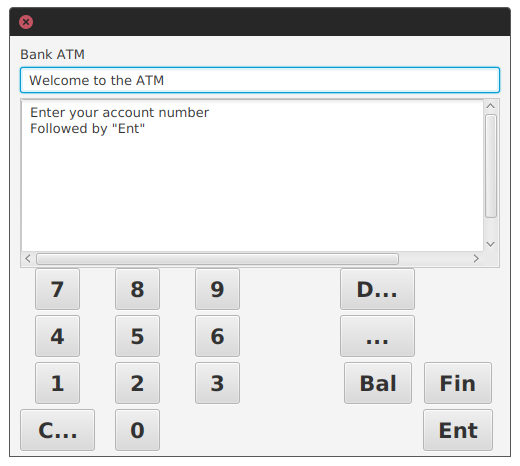
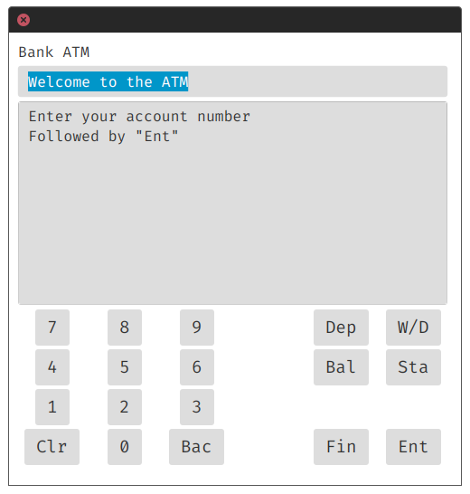
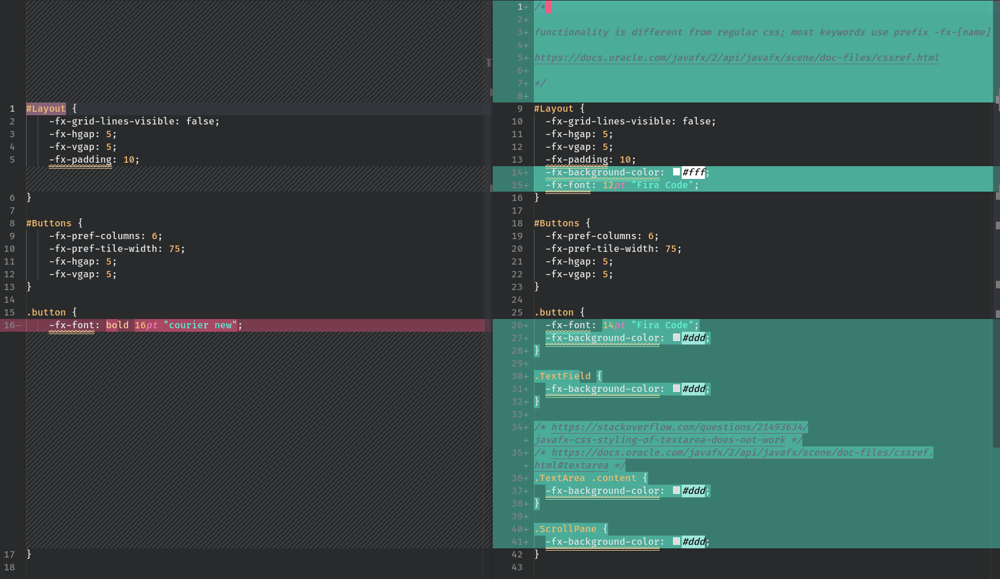
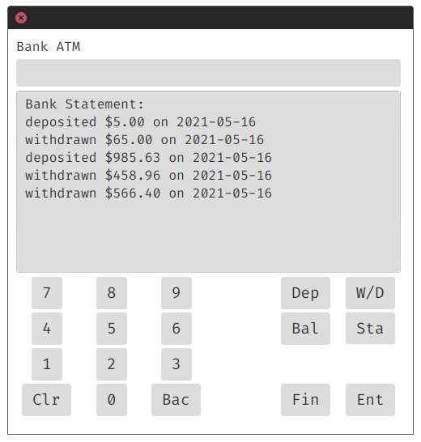
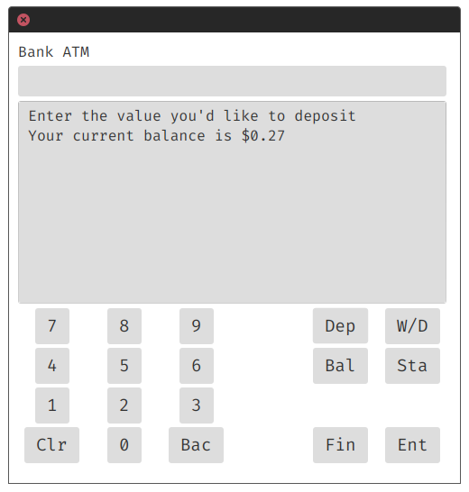

# Technical Report

[Return to README](README.md)

* [Technical Report](#technical-report)
  * [Gradle Building](#gradle-building)
  * [Colour & CSS Styling](#colour--css-styling)
  * [Mini-Statement](#mini-statement)
  * [Account Types & Overdraft](#account-types--overdraft)
  * [Withdraw & Deposit Expansion](#withdraw--deposit-expansion)
    * [Issues with State](#issues-with-state)
    * [Substate](#substate)
    * [`processNumber` and `processBack()`](#processnumber-and-processback)
  * [Decimal currency & Currency Locale](#decimal-currency--currency-locale)
  * [Type Changes](#type-changes)
  * [Input Shortening](#input-shortening)
  * [Backspace](#backspace)

## Gradle Building

After installing Gradle to my system, I ran `gradle init` to set up a Gradle project in the directory [following this documentation](https://docs.gradle.org/current/userguide/build_init_plugin.html). This adds the Gradle wrapper automatically, which is executable in \*nix shells and windows command lines, depending on which executable is used (`gradlew` or `gradlew.bat`). After this, the provided source code was added into the `/src/main/java` directory, with an extra `resources` directory created in the `/src/main` directory for the .css file provided.

Finally, `build.gradle` was modified to require a JavaFX plugin named `openjfx`, specifying a version of JavaFX to be targeted, and the Main class was added. The command for building documentation was also added in on line 18.

The project now runs from source using the command `gradlew run`, compiles using `gradlew build`, and builds documentation using `gradlew doc`. The .gitignore is added to exclude various binaries and non-required segments, using <https://gitignore.io>.

This build system is preferable to using BlueJ or similar as it's much more standardised and is cross platform compatible. Gradle build systems (and similar) are the standard for modern Java projects, and as such I added it in to demonstrate my understanding of the importance and of how to implement such a system.

## Colour & CSS Styling

Stock CSS:

Modified CSS:

Diff of the two files:

The majority of the changes in the CSS revolve around the font family, font size, and background color to the elements on screen. It's a minor change, though the effect it has is pronounced due to the improved legibility. There's some documentation links included in comments too.

- <https://docs.oracle.com/javafx/2/api/javafx/scene/doc-files/cssref.html>
- <https://stackoverflow.com/questions/21493634/javafx-css-styling-of-textarea-does-not-work>
- <https://docs.oracle.com/javafx/2/api/javafx/scene/doc-files/cssref.html#textarea>

## Mini-Statement

This statement feature was added in by adding an extra button (Sta), adding in a handler in Controller.java (line 74), adding in the setStatement() function in Model.java (line 394), extending the Deposit and Withdraw methods in Model.java to append a string with the currency and date to a new history object in the BankAccount class. This was relatively simple to implement, and just involved following the logic already provided by the ATM MVC system.

## Account Types & Overdraft

Account 10001 and 10002 (with passwords 11111 and 22222 respectively) are kept from the original source code, with accounts 91820 and 382911 (with passwords 38209 and 532824 respectively) being added in. These accounts differ by being `BankAccountPlus` objects, which extend the original `BankAccount` class and add some extra functionality. This is an example of inheritance.

`BankAccountPlus` extends the `withdraw` method, adding in some extra logic which calculates based off the overdraft limit. On top of this, it adds some extra methods for getting and setting the overdraft limit, as well as a new constructor.

- Private `overdraftLimit` Long value
- New Constructor
- modified withdraw method
- `getOverdraftLimit` and `getOverdraftLimitInteger` methods
- `setOverdraftLimit` method

On top of this, the Bank class has some modified methods, including `makeBankAccount` and `addBankAccount`, taking in some extra parameters to determine the type of bank account. This properly utilises the factory method, which is added in the original source code.

- `makeBankAccount`, where `accountType` and `values` are new, `values` being interesting because it utilises the elipsis.
- `addBankAccount`, where the extra parameters for `makeBankAccount` are also added to the integer/String/Long overflow.

Since BankAccountPlus is derived from BankAccount, it fits into the `Bank` class' `BankAccount[]` array, even though it's a different object type.

The added functionality allows for a bank account to be constructed with an overdraft, allowing the user to withdraw more balance than is present in the account. This could be extended very easily to allow extra functionality for different account types, just by adding a new class and modifying the factory class. Finally, overdraft limit is controlled by the constructor for the class, allowing differing quantities based on the specific account.

## Withdraw & Deposit Expansion

The withdraw and deposit functions have been extended to utilise a second state value, which functions similarly to how the user logs in: they press some buttons, then press `Ent`, which enters the value they've added. This functionality is continued in the Withdraw and Deposit functions, which also now show extra data when the button is pushed (see above).

### Issues with State

The Model class utilises the variable `state`, a string that has one of four possible values: null, "account_no", "password" and "logged_in". My first idea to implement this functionality of having menus pop up for the different functions involved adding in extra final (immutable) strings for depositing and withdrawing, but that involved some difficulties where the account would be logged out.

This is because when `state` holds the value `LOGGED_IN`, other methods check the state and only continue when it matches with `LOGGED_IN`. This means that changing it to `DEPOSITING` removes the `LOGGED_IN` state, which can cause some messy issues where the user is logged out or cannot access most methods. I didn't want to add new states to this which count as `LOGGED_IN` but hold extra data, so instead I implemented a secondary state called `substate`.

### Substate

`substate` also has fixed values, although it's range is "none", "deposit", "withdraw", "balance" and "statement". This variable preserves the original `state` as `LOGGED_IN`, and allows extra information about the state of the application to be conveyed.

This functionality is added by having `substate` update whenever the user presses a function button. For example, when they go to deposit money, they push Dep, which then sets `substate` to `SUBSTATE_DEPOSIT`. It then displays some information about the current balance. On top of this, the display method for the top box is changed, adding in currency locale. This is explained more later on. Finally, when the user enters the value they want to deposit and hit enter, the `processEnter` method switches the `substate` value and calls `processWithdraw` because it matches with `SUBSTATE_WITHDRAW`.

This difference changes depositing and withdrawing from a two step operation (i.e. typing then depositing) to a three step operation (i.e. push button, type, hit enter), and adds additional information that is relevant to the user. On top of this, additional functionality is easily added by extending the substate features, like adding in extra switch cases.

### `processNumber` and `processBack()`

These methods now also switch the substate, and format the display value provided that the case is `SUBSTATE_DEPOSIT` or `SUBSTATE_WITHDRAW`. This means that the values entered show up as currency values, rather than as simple numbers. See the next heading for a description on this.

## Decimal currency & Currency Locale

Along with currency locale, I added in decimal currency by utilising the stored value as the amount someone has in an account multiplied by 100. The model class has a `formatCurrency` method with integer, String and Long overloads, allowing for the value to be formatted for display. This involves loading a `DecimalFormat`, a native object in `Java.Text`, which has some functionality for formatting numbers. `getCurrencyInstance` loads the system currency into this decimal format, which is then applied to the value.

The value is formatted by `dFormat.format()`, and divided by `100.0`, a BigDecimal that maintains precision (as is required with an ATM). This means that a value of `500` will be displayed as `$5.00` on my system, as the system locale specifies American currency and language (due to my keyboard layout).

**Locale isn't consistent across device**, meaning that 100 on my system and 100 on a european system are different monetary values, which is unintentional. Fortunately, currency conversion is out of the scope of this project, and would require some web fetching to convert between one locale and another, along with an extra store of the current locale & value.

## Type Changes

The majority of my modification around type changing is in utilising Longs for specific values over Integers, as they have double the precision and double the maximum value. The maximum value of a signed int32 is `(2 ^ 31) - 1`, or 2,147,483,647. This value is concievably an amount that someone could have in a bank account, especially so when you convert it to decimal by dividing by 100: 21,474,836.47. Because of this, double precision is required in the form of a Long.

This has many changes across the codebase, including some addition of some overloaded methods for integers and Long integers, of which it's easy to convert between the two. Functionally speaking, I don't think there's any case where the value of the Long is ever cast to an integer where data can be lost, which is definitely what I intended for this project.

## Input Shortening

The input box is limited to a maximum length of 9 to prevent integer overflows. This could be handled more cleanly by utilising BigIntegers or Long values, but given that it's just a simple input box, this isn't required too strongly. This functionality is enforced in the Model class on line 174.

## Backspace

Finally, the addition of a backspace button was something I decided to add, as it allows for the user to remove a single typo and not need to start from scratch. This works by splitting the string entered by the user, converting it from it's current length to it's current length minus one. This functionality is visible on line 209 of the Model class and line 56 on the Controller class.
