# CI405 A2 notebook

Charlotte Ward | CI405 Assignment 2 | Year 1 CSG

* [CI405 A2 notebook](#ci405-a2-notebook)
  * [Week 1 Questions](#week-1-questions)
  * [Week 1 Lab Work](#week-1-lab-work)
    * [Step 0: Downloads](#step-0-downloads)
    * [Step 1: Creating a VM and allocating resources](#step-1-creating-a-vm-and-allocating-resources)
    * [Step 2: Install the operating system using the ISO](#step-2-install-the-operating-system-using-the-iso)
    * [Step 3: Create a user account and apply updates](#step-3-create-a-user-account-and-apply-updates)
  * [Week 2 Questions](#week-2-questions)
  * [Week 2 Lab Work](#week-2-lab-work)
  * [Week 3 Questions](#week-3-questions)
  * [Week 3 Lab Work](#week-3-lab-work)
  * [Week 4 Questions](#week-4-questions)
  * [Week 4 Lab Work](#week-4-lab-work)
  * [Week 5 Questions](#week-5-questions)
  * [Week 5 Lab Work](#week-5-lab-work)
  * [Week 7 Questions](#week-7-questions)
  * [Week 7 Lab Work](#week-7-lab-work)
  * [Week 8 Questions](#week-8-questions)
  * [Week 8 Lab Work](#week-8-lab-work)

## Week 1 Questions

| Question 1: Define the four main components of a computer. |
| :--------------------------------------------------------- |

Input, Processor, Memory, Output.

Other components can be added in to optimise this, but the core concept of a computer (vs. a Turing machine or similar) revolves around Input and Output.

| Question 2: Explain the difference between a fixed program computer and a stored program computer. |
| :------------------------------------------------------------------------------------------------- |

Fixed program computers have a set operation and control flow, whereas stored program computers can be modified before, during and after execution. Fixed program computers can be very simple and cheap, whereas stored program computers are more complex but more versatile. Most modern computers are stored program computers, whereas IOT devices and chipsets are often stored program computers.

<https://www.britannica.com/technology/stored-program-concept>

| Question 3: What is Gordon Bell’s law about the near future of computer class? |
| :----------------------------------------------------------------------------- |

Gordon Bell's law determines the scale and ubiquity of computer systems, explaining how computers are getting smaller and more prolific in society. He describes that Mainframe computers were initially the most important, though with time computers are getting smaller and more ubiquitous, to the point that modern computers may look more like swarms of sensors and microcomputers. He states that there is a new class of computer every decade, derived from cheaper components and transistors. This class can then overtake existing classes as it evolves.

<http://gordonbell.azurewebsites.net/CACM%20Bell>'s%20Law%20Vol%2051.%202008-January.pdf

## Week 1 Lab Work

```plaintext
Task: instructions to install Fedora on Virtual Box

Step 0: Download Fedora from https://getfedora.org/en/workstation/ & install VirtualBox (apt)
Step 1: Creating a VM and allocating resources
Step 2: Install the operating system using the ISO
Step 3: Create a user account and apply updates
```

### Step 0: Downloads

I already have VirtualBox installed on my operating system as it's useful for trying out other Linux distributions and emulating various operating systems. I downloaded the Fedora ISO from the website easily and have it ready in my Downloads folder.

### Step 1: Creating a VM and allocating resources

VirtualBox Main View

Setting up the Operating System with a name and type

Setting memory to 4096MB

Setting the disk type to VMDK for Compatibility

Setting the VMDK disk to 16GB

The new home screen for VirtualBox

Setting a boot disk for Fedora

Selecting the ISO from my Downloads folder

Here it is properly set up as a Live CD

On boot it asks for a start-up disk, set that to Fedora


### Step 2: Install the operating system using the ISO

Freshly launched

Here's the live disk bootloader

Linux boot screen

Fedora uses a fairly stock Gnome Linux installer - Install to Disk

Set the keyboard language to English US

Set the hard disk to the VBOX Hard Drive

Everything seems ok, ready to begin

All installed on disk

Now to reboot

Almost ready to reboot

Disconnect the Live CD


### Step 3: Create a user account and apply updates

Select the correct bootloader in... looks like systemd-boot?

Booting nice and quickly

All okay! Fedora setup looks a lot like Ubuntu

Turn off tracking and such

Set up the user name

Set up the user password

Now to apply updates

Fedora has a nice stock Gnome experience

Lovely old bash
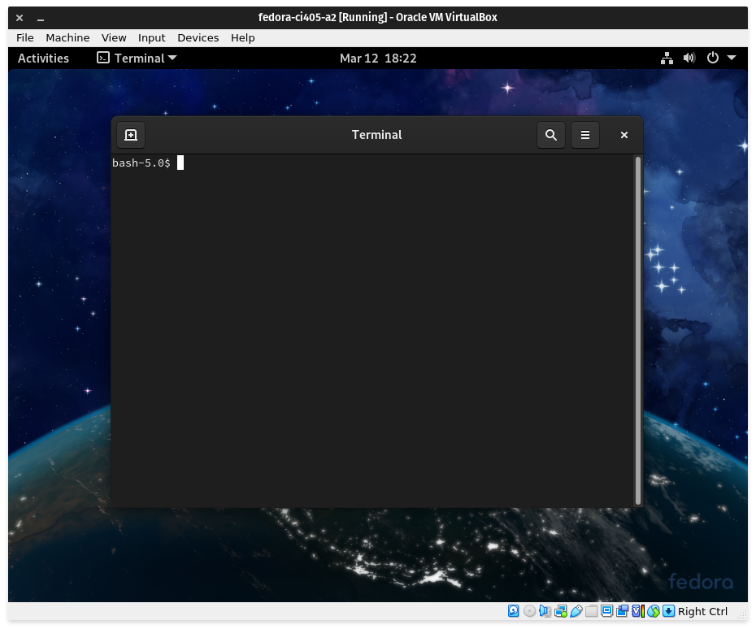
Starting the sudo dnf upgrade
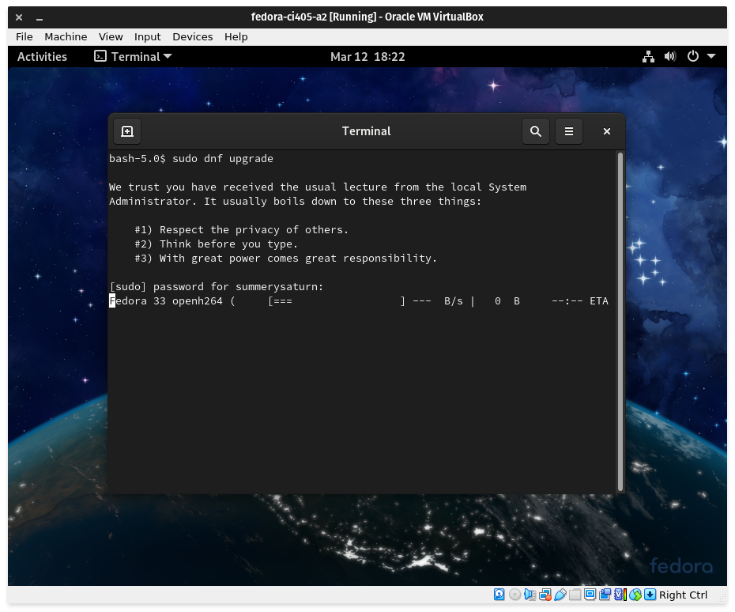
1.1GiB is a lot of data, 800+ packages. Wow.

9 minutes of execution time. wow.
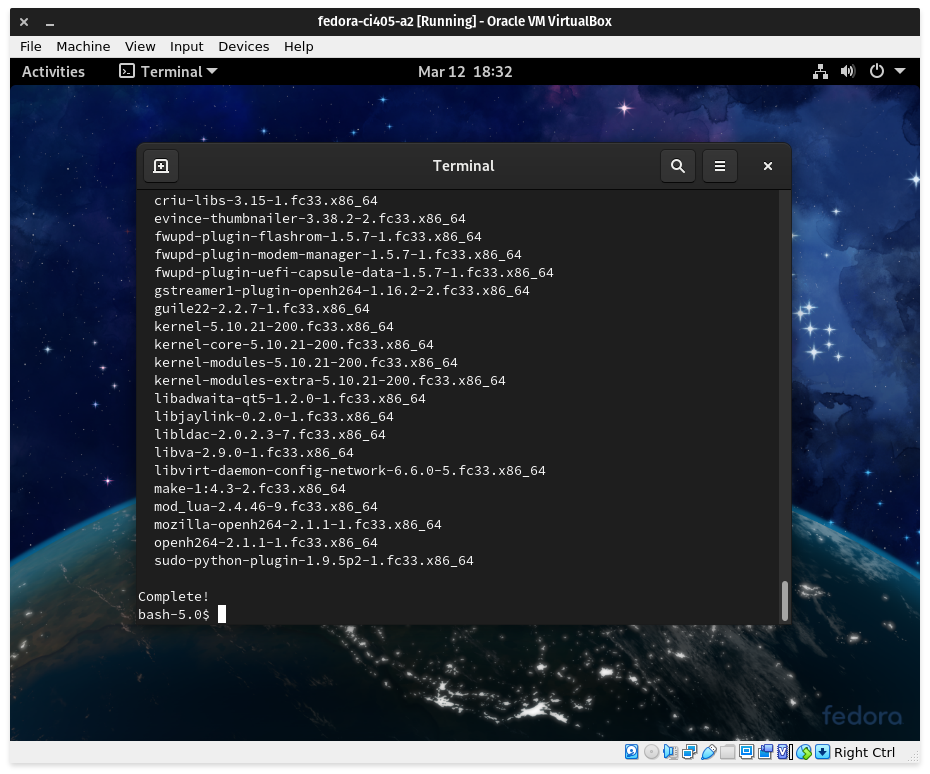

## Week 2 Questions

| Question 1: Explain Moore’s law. Is Moore’s law a Physics law? |
| :------------------------------------------------------------- |

Moore's law specifies that transistor quantity in CPUs will double every two years, as a result of improvements in transistor technology and manufacturing techniques.

It is not a physics law like Newton's laws or similar, instead it is a projection based on observations of CPU transistor quantities prior to 1965.

<https://www.investopedia.com/terms/m/mooreslaw.asp>

| Question 2: Modern CPUs are measured in nano-metre scale (e.g. 14 nm CPU). What does this number mean? Is this the size of each individual transistor? |
| :----------------------------------------------------------------------------------------------------------------------------------------------------- |

The nano-meter scale relates to the physical size of each transistor, though more accurately it relates to the physical process that the manufacturer uses to design and manufacture the CPU; a 14nm CPU will be a die cut from a larger wafer, with many copies of the die circuit etched into it from photolithography. The size of the process relates to the smallest possible transistor using the technique, though it doesn't necessarily relate to the size of each transistor on the die; it's easier to think of it as the resolution of the process.

<https://www.howtogeek.com/394267/what-do-7nm-and-10nm-mean-and-why-do-they-matter/>

| Question 3: Describe the quantum tunneling problem in the transistor design. |
| :--------------------------------------------------------------------------- |

As dies are shrinking more and more, the sizes are getting small enough for quantum phenomena to start acting upon the electrons utilised by the semiconductors in the die. One major problem with this is Quantum Tunneling, whereby a wavefunction (i.e. an electron, which exhibits) can tunnel through a barrier. This is possible due to the quantum uncertainty principle, which states that it's impossible to measure both position and momentum to a certain degree of accuracy; this limit causes waves to have a low probability of tunneling through an obstacle, depending on the size of the barrier. With decreasing process sizes, this is becoming more and more of an issue.

<https://spectrum.ieee.org/semiconductors/devices/the-tunneling-transistor>

## Week 2 Lab Work

```plaintext
Task: Performing the following Linux commands, using one of the environments we set up in Week 1.

$ date
$ date > today
$ cat today
$ date >> today
$ cat today
$ cal 1 2010
$ ls
$ ls -l
$ ls -l > files
$ cat *
$ cat p*
$ mkdir mysub
$ ls
$ cd mysub
$ cd ..
$ pwd
$ cd .
$ cd ~
$ ls ~/mysub
$ ls ~
$ ls ~/..
$ cp today tomorrow
$ cd ~/mysub
$ cp ~/tomorrow .
$ ls
$ mv tomorrow files.txt
$ rm files.txt
```

Date, Cat and basic redirection operators

Calendar and Who commands

ls, ls -l commands

ls with redirection operators

cat with wildcard operator

cat with wildcard operator (cont.)

pwd, cd, directory handling

Moving and removing files


## Week 3 Questions

| Question 1: What is RowHammer? What are the potential solutions? |
| :--------------------------------------------------------------- |

Relating to physical design of modern DRAM modules, RowHammer is a hardware-level exploit whereby protected bytes on a module can be rewritten by quickly and repeatedly activating rows of memory, like to write, can cause adjacent cells to have random bit flips, which can result in the contents of memory being altered and then executed.

<https://www.techopedia.com/definition/31413/rowhammer>

| Question 2: Compare the three levels of cache. |
| :--------------------------------------------- |

As memory gets closer to the CPU, it increases in speed as well. Hard drives are exceptionally slow compared to the CPU itself, so it needs intermediary storage. RAM is faster, however it's still not fast enough for the CPU to properly utilise (even if it has high throughput: latency is an issue). To solve this, CPUs utilise various levels of cache, which decrease in size as they get faster.

At the lowest level, CPUs utilise registers to store small amounts of super-fast data, which can be directly operated upon as part of their Fetch-Decode-Execute cycle. These registers are tiny, usually having less than a kilobyte of size. To supplement this, L1 cache, or Level 1, can quickly interact with the registers, swapping out data as needed. L1 cache is in the neighbourhood of 32 kilobytes, which is considerably more than the registers.

On top of this, L2 cache is above L1, with much larger size, greater than half a megabyte in today's industry. These modules are slightly slower, but help to step the speed up as data approaches the CPU itself. Finally, there's L3 cache, which sits directly between L2 cache and the RAM, with much larger sizes up to about 32 megabytes. This cache is slowest, though it's still considerably faster than RAM. Again, this helps to step up data as it's needed.

Multi-Core CPUs complicate this issue, as each CPU needs it's own cache, fed from the L3 cache, which is usually global. L2 tends to be split off into each core. Additionally, some CPUs may utilise L0 cache or other types of L1 cache, although the same principles apply; data must be sped up gradually as it's needed by the CPU, which manages this data operation itself.

<https://www.techspot.com/article/2066-cpu-l1-l2-l3-cache/>

| Question 3: Explain the differences between RAID 1, 5 and 10. |
| :------------------------------------------------------------ |

This question relates to various methods for backing up data using RAID:

RAID 1 involves mirroring one drive onto another drive, effectively duplicating the contents of one to the other every write. This is a transparent way to back up data, as each drive can read and write simultaneously. Additionally, it protects the data on the array from a single drive failure, as both drives would need to fail for the data to be lost.

RAID 5 involves spanning the data across multiple drives using stripes, whereby all the drives have a single visible partition on it. This is slightly more opaque than RAID 1, as the data must be split up using a RAID controller or similar and distributed to each drive. This can speed up reads and writes though, as you get the combined throughput of each drive.

Additionally, RAID 5 has so-called 'parity blocks', whereby the stripes distributed across the other drives are run through a checksum, resulting in a unique block which can be used to recover data should a single drive on the array be lost; the data on the missing drive can be reconstructed using the other drives and with the parity data, by reversing the checksum. This can protect many drives from single drive failures, without having to clone one to one. The downside of RAID 5 is that the whole array can be lost should multiple drives fail in quick succession.

RAID 10 is a fusion of RAID 0, where drives are striped and blocks are spanned across the stripes, and RAID 1, where drives are mirrored one to one. This means that the throughput is doubled like with RAID 0, but affords two drive failures (although not on the same side of the span). This is inefficient compared to RAID 1 and RAID 5, as it's less fast than RAID 5 and less resistant to failure than RAID 1, however it's a good option for one to one mirorring with improved throughput.

<https://www.prepressure.com/library/technology/raid>

| Question 4: Describe the concept of processing in memory. |
| :-------------------------------------------------------- |

With processing becoming more easy on smaller and cheaper components, storage in memory revolves around the memory module itself optimising it's own storage to better serve the system accessing the memory itself. This can be seen in Solid State Hard Drives, where a small SSD cache (usually around 32GB) is paired with a larger hard disk drive, and an onboard processor stores data that is accessed more often on the SSD cache due to increased speed and decreased latency.

This concept is used today in products like Intel Optane, whereby a high-speed SSD and processor is used to supplement another drive.

<https://www.techopedia.com/definition/29395/processing-in-memory-pim>

## Week 3 Lab Work

```plaintext
Task: Performing the following Linux commands, using one of the environments we set up in Week 1.

$ ps -ef
$ sleep 10 &
$ sleep 1000 (then ctrl+z)
$ bg
$ jobs
$ fg %1

$ sleep 100 (then ctrl+c)
$ sleep 100 &
$ jobs
$ kill %1

$ sleep 1000 &
$ ps
$ kill (pid)
$ kill -9 (pid)

$ vi
  Enter the text: "The quick fox jumps over the lazy dog"
  Find a way to save this text into a file “viFile.txt” without quitting.
  Find a way to quit the editor now.
  List the content of this file with the more and the cat commands.

$ wget https://gutenberg.org/files/1661/1661-0.txt
$ head -20 1661-0.txt
```

Basic background processes
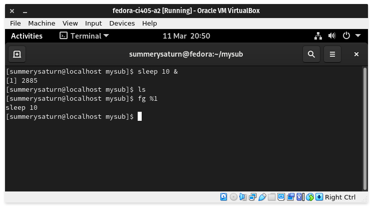
Ctrl+Z Operator & bg

Jobs & killing based on job list
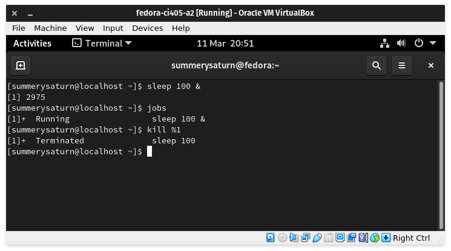
ps command & killing based on pid

vi editing
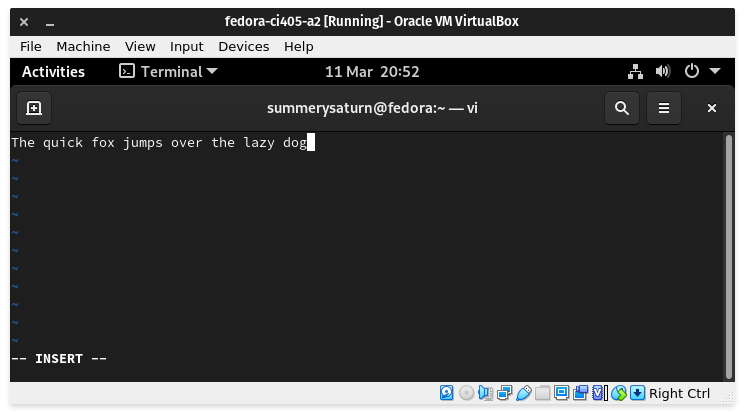
Writing the vi editor to out (viFile.txt)

Writes ok...

Force quit

Quit ok...

cat the file
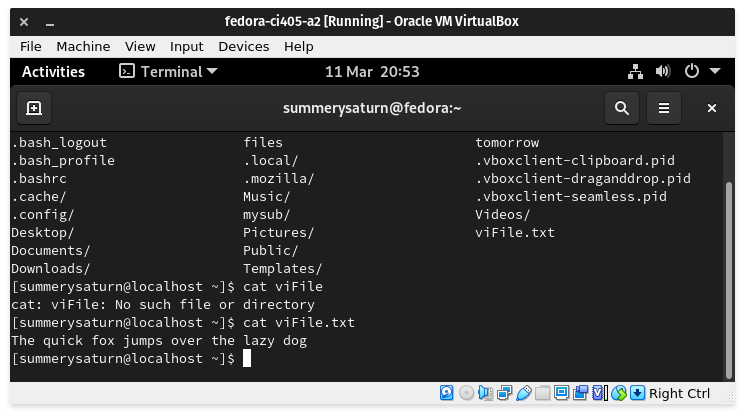
more the file

wget from the directory provided

Showing the file using less

Showing the first 20 lines using head -20

Showing the first 20 lines using head -20


## Week 4 Questions

| Question 1: Explain the difference between a digital sensor and an analog sensor. |
| :-------------------------------------------------------------------------------- |

Digital sensors produce a digital signal rather than an analogue signal, which could require extra processing on top to interpret for a computer; digital sensors are easier to use with computers.

| Question 2: Describe the responsibilities of the “Cloud processing unit” (the top layer of IoT). |
| :----------------------------------------------------------------------------------------------- |

With regards to IoT, the cloud processing unit is a server or decentralised set of servers which process and store data from computers lower in the stack. This means that all of the IoT devices communicate with the top layer of the stack for processing and storage rather than having local processing and storage like with traditional computers.

| Question 3: Explain the difference between a microcontroller (e.g. Arduino) and an embedded board (e.g. Raspberry Pi). |
| :--------------------------------------------------------------------------------------------------------------------- |

Microcontrollers like Arduinos use firmware to perform tasks, whereas embedded boards like a Raspberry Pi have a full operating system which then uses software to perform a task. Microcontrollers don't have a full operating system and are very focussed when compared with embedded boards which can have much broader tasks. Firmware is faster than software which also makes microcontrollers cheaper due to lower hardware and software complexity.

## Week 4 Lab Work

Installing OpenJDK 11

Using vim to edit HelloWorld.java

Showing that HelloWorld.java exists using cat (batcat)

Compiling HelloWorld.java into a class and then running it using Java

Editing the file to use the arguments as shown in the example

Compiling it and running it using no arguments and two arguments


## Week 5 Questions

| Question 1: Describe the challenges facing mobile computing technology. |
| :---------------------------------------------------------------------- |

These days there aren't many issues with mobile computing anymore, as performance and portability have largely been solved through optimisations and improvements in production technology; modern mobile CPUs are incredibly performant, outpacing computers from as little as a decade or two ago.

Because of this, technology in the mobile computing ecosystem has been primarily focussed on downsizing existing technology, relating to storage, processors, GPUs, displays, and other features which are commonplace on larger electronics; high refresh rate display panels are beginning to find a place in the mobile market, owing to improved production processes.

| Question 2: What is context awareness? Give one example of a context awareness mobile app. |
| :----------------------------------------------------------------------------------------- |

Context awareness is where a mobile application can utilise existing system context, like time and previous app usage, to change behaviour. This is primarily used for features such as app suggestion, whereby usage statistics can be utilised to recommend an app that the user commonly uses at that time, in that place, or in that order.

| Question 3: What are the challenges for doing Augmented Reality on a mobile device? |
| :---------------------------------------------------------------------------------- |

Most of the challenges revolve around machine vision, as the visual signal from the camera(s) can be quite complex to process and add onto; Augmented reality involves a 3D renderer that renders over the image of a camera, and doing so in 3D space is complex enough on its own without factoring in depth and object occlusion.

Additionally, some forms of augmented reality utilise a fixed eye position to properly overlay the image onto a user's vision, whereas mobile AR doesn't have the ability to do this without mounting the phone to someone's head; the Microsoft Hololens uses a transparent display to add in elements to the user's vision, rather than on a video feed on a screen.

## Week 5 Lab Work

Editing a simple shell script that performs the pwd and ls commands

Editing a simple shell script that asks the user's name then says Hello to them

Here it is being run

Simple shell script showing loop capability

Simple shell script showing loop capability being executed

Simple shell script demonstrating while loops and getting an input to break or continue the loop

Here it is being executed


## Week 7 Questions

| Question 1: Describe the three steps to design a circuit, given the specification. |
| :--------------------------------------------------------------------------------- |
|                                                                                    |

Write the truth table: Using the specification, you can map out a truth table using all the expected inputs and outputs.

Deriving the Boolean expression: Utilising the truth table, you can work out all the boolean expressions relevant to the circuit based on the required inputs and outputs.

Simplifying the expression: Utilising logical axioms and laws, you can begin to simplify the boolean expression, which helps to demonstrate what elements are needed in the circuit.

| Question 2: Explain the difference between a sequential logic circuit and a combinational logic circuit. |
| :------------------------------------------------------------------------------------------------------- |
|                                                                                                          |

Combinational logic is sometimes described as time independent logic, as the logic is determined by the inputs at a single time. There's no concept of state. This differs from sequential logic, where various combinational logic elements are utilised to imply a logical state, whereby the logic of a system is dependent on time, previous and future inputs; adders and multiplexers are combinationally logical, whereas flip-flops are sequentially logical.

As a rule, in Combinational logic, the output is deterministic based on the inputs, whereas in Sequential logic it is not.

<https://www.differencebetween.com/difference-between-combinational-and-sequential-logic/>

| Question 3: Describe the Set-Reset Flip-Flop. What is its problem? |
| :----------------------------------------------------------------- |
|                                                                    |

This circuit is a bi-stable circuit used in sequential logic, effectively a 1-bit memory cell that can store a value. This value can be set or reset depending on the input utilised. It's one of the most simple memory cells, and as such has issues. These issues revolve around the truth table having some states that are non-allowed or indeterminate, making the operation of the SR flip-flop more complex. The truth table is as follows:

| !S  | !R  | Q   | !Q  | Comments                                                           |
| :-- | :-- | :-- | :-- | :----------------------------------------------------------------- |
| 0   | 1   | 1   | 0   | Q is set to 1 by 0 on !S                                           |
| 1   | 1   | 1   | 0   | No change (1 on Q is remembered)                                   |
| 1   | 0   | 0   | 1   | Q is reset to 0 by 0 on !R                                         |
| 1   | 1   | 0   | 1   | No change (0 on Q is remembered)                                   |
| 0   | 0   | 1   | 1   | Both inputs at 0 - both outputs are 1 (non-allowed state)          |
| 1   | 1   | ?   | ?   | Inputs change from 0,0 to 1,1 together - Outputs are indeterminate |

Due to the non-allowed state and the indeterminate value, this circuit is usually not utilised over more complex memory cells, though the ideas utilised by the SR latch carry over.

<https://www.learnabout-electronics.org/Digital/dig52.php>

## Week 7 Lab Work

Circuit diagram

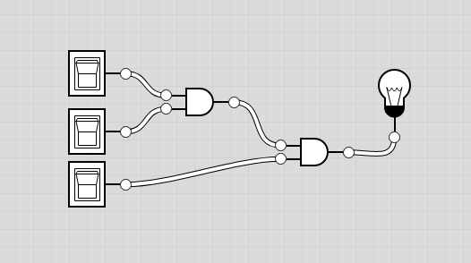

This tool can generate a truth table based on the circuit.

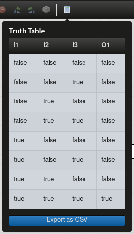

The task is to create a circuit using this truth table. I've added in expressions for the table.

| I1  | I2  | I3  | O1  | Expression     |
| :-- | :-- | :-- | :-- | :------------- |
| 0   | 0   | 0   | 0   |                |
| 0   | 0   | 1   | 0   |                |
| 0   | 1   | 0   | 1   | `!I1. I2. !I3` |
| 0   | 1   | 1   | 1   | `!I1. I32. I`  |
| 1   | 0   | 0   | 0   |                |
| 1   | 0   | 1   | 0   |                |
| 1   | 1   | 0   | 0   |                |
| 1   | 1   | 1   | 1   | `I1. I2. I3`   |

Using this table, we can work out that the boolean expression for this truth table is:

`!I1. I2. !I3 + !I1. I2. I3 + I1. I2. I3`

Each `.` is an and gate, and each `+` is an or gate. Using this, the circuit looks like this:

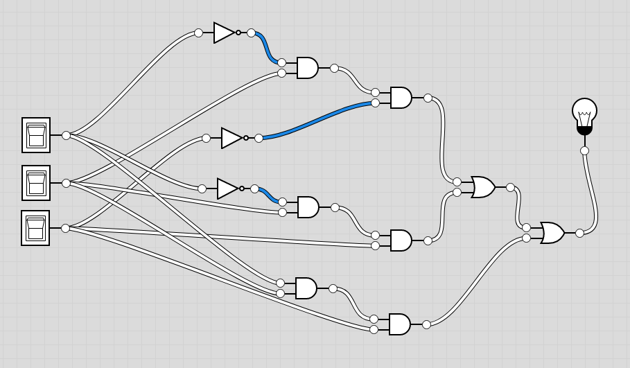

This circuit is very messy, however. Utilising these laws and axioms, it's possible to simplify this boolean expression.

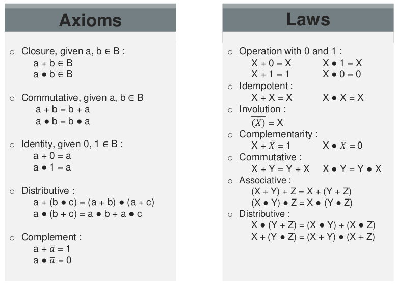

## Week 8 Questions

| Question 1: What is a data bus, an address bus, and a control bus? |
| :----------------------------------------------------------------- |
|                                                                    |

Data busses are a set of wires or a connector inside a computer used for sending data. It often has a bit width of a power of 2, such as 8, 16, 64, etc. This differs from an address bus, which is utilised to address specific memory on another device or another memory location. Data busses directly send data whereas an address bus is more of a data reference.

Control busses usually refer to system clock or to interrupt request, but the general idea is that they involve control from the CPU or a various chipset for submodules in the PC. The clock and interrupt request busses are utilised by other chips in the PC, such as with memory cells, which rely on clk to set and unset bits.

https://www.techopedia.com/definition/6733/data-bus

https://www.techopedia.com/definition/292/address-bus

https://www.techopedia.com/definition/303/control-bus

| Question 2: Explain the signal reflection problem. |
| :------------------------------------------------- |
|                                                    |

Signal reflection is where hardware interfaces like cables or wireless transmissions can be partially reflected rather than being absorbed by the opposing receiver. This can affect the clarity of the signal, potentially causing data loss due to the signal being less clear. With physical cables it arises because of imperfections in the cable, whether it's copper or fiber or something else. In ideal scenarios it's not a problem, but with real-world scenarios it must be considered as a factor as it can introduce issues.

https://www.infobloom.com/what-is-signal-reflection.htm

| Question 3: What are the problems of parallel communication? |
| :----------------------------------------------------------- |
|                                                              |

Parallel communication is where data is sent using multiple data lines, a byte or more at a time, rather than a single data line, with each bit in a sequence. It is much faster as there's simply more width to the connection. Some of the issues arise from the hardware complexity of the communication, as it takes at least 8x as many traces/wires to implement. Additionally, if a single line is damaged, all of the data sent will be incomplete. Finally, crosstalk is a phenomenon whereby some of the bits can be flipped due to various types of interference, causing the bytes sent to be incorrect. These issues are mitigated in serial communication as it's more obvious if the data is corrupted, and the overall complexity is much lower.

## Week 8 Lab Work

1. Download the following files on the course website. Make sure they are in the same directory.

- _junit-4.12.jar_: the main JUnit testing package.
- _hamcrest-core-1.3.jar_: the frameowrk for doing object matchings.
- _Calculator.java_: the Java program to be tested. It contains a function to add 2 numbers.

2. Create the following Java tester file "CalculatorTest.java".

   ```Java
   import static org.junit.Assert.*;
   import org.junit.Test;

   public class CalculatorTest
   {
     @Test
     public void testAdd1() // 1st test
     {
       Calculator calculator = new Calculator();  // create a new object to be tested
       double result = calculator.add(10, 50);    // try adding 50 to 10
       assertEquals(60, result, 0);               // used to check the result
     }

     @Test
     public void testAdd2()
     {
       Calculator calculator = new Calculator();
       double result = calculator.add(7.5,1.5);
       assertEquals(9.0, result, 0);
     }
   }
   ```

3. Compile all java files. The command line argument `-cp` is used to specify the class path of the JUnit files. On Linux: `javac -cp .:junit-4.12.jar:hamcrest-core-1.3.jar *.java`
4. Run the test. On Linux: `java -cp .:junit-4.12.jar:hamcrest-core-1.3.jar org.junit.runner.JUnitCore CalculatorTest`

Nothing too bad this week, just some effort making sure that I've followed the brief properly.

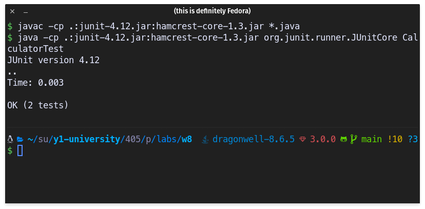
