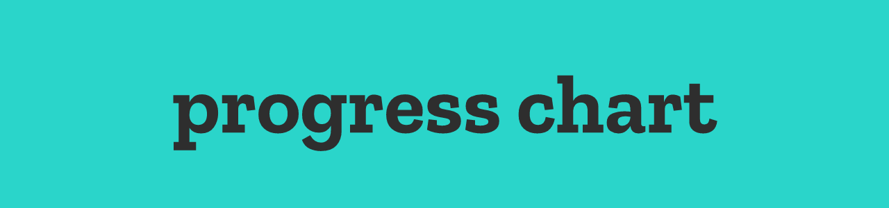

# 

<br/>

<h3 align="center">
 :warning: :warning: :warning: :warning: :warning:
</h3>

This repository contains the specifications for my course and is going to be used primarily for version control for my university work. While the content in each folder is licensed under the MIT License, any content included should not be used directly before the end of the year because of restrictions on plagiarism. Feel free to read through if you're stuck or confused, but using this content directly for your own course is prohibited.

<h3 align="center">
 :warning: :warning: :warning: :warning: :warning:
</h3>

<br/>

This course is comprised of 6 modules for the first year, all exploring different topics around computer science and game design/development. This repository abbreviates these using their module shortcode, or their number, and an emoji. All of the modules are in the CI4XX family, relating to the course level (Level 4) and the course type. For context, year 2 is CI5XX, and year 3 is CI6XX. Because of this, CI401 can be shortened to 01 (like in the issue tracker for assignments).

| Key                           | Module Name               |
| :---------------------------- | :------------------------ |
| :building_construction: CI401 | Intro to Programming      |
| :computer: CI405              | Computing Technologies    |
| :video_game: CI410            | Game Design & Development |
| :globe_with_meridians: CI435  | Web Development           |
| :mortar_board: CI465          | Digital Industries        |
| :art: CI474                   | 3D Modelling              |

## 

### A1 Progress Chart

| Module                       | Issues                                                                   | Assignment Priority          | Note      |
| :--------------------------- | :----------------------------------------------------------------------- | :--------------------------- | :-------- |
| :video_game: CI410           | [#11](https://github.com/summerysaturn/y1-university/issues/11) (closed) | :white_check_mark: Submitted | Submitted |
| :globe_with_meridians: CI435 | [#6](https://github.com/summerysaturn/y1-university/issues/6) (closed)   | :white_check_mark: Submitted | Submitted |
| :mortar_board: CI465         | [#13](https://github.com/summerysaturn/y1-university/issues/13) (closed) | :white_check_mark: Submitted | Submitted |

### A2 Progress Chart

| Module                        | Issues                                                                   | Assignment Priority | Note      |
| :---------------------------- | :----------------------------------------------------------------------- | :------------------ | :-------- |
| :building_construction: CI401 | [#19](https://github.com/summerysaturn/y1-university/issues/19) (closed) | :white_check_mark:  | :x:       |
| :computer: CI405              | [#20](https://github.com/summerysaturn/y1-university/issues/20) (closed) | :white_check_mark:  | Submitted |
| :video_game: CI410            | [#16](https://github.com/summerysaturn/y1-university/issues/16)          | :one: 1             | :x:       |
| :globe_with_meridians: CI435  | [#21](https://github.com/summerysaturn/y1-university/issues/21) (closed) | :white_check_mark:  | :x:       |
| :mortar_board: CI465          | [#17](https://github.com/summerysaturn/y1-university/issues/17) (closed) | :white_check_mark:  | :x:       |
| :art: CI474 A2                | [#22](https://github.com/summerysaturn/y1-university/issues/22)          | :white_check_mark:  | :x:       |
| :art: CI474 A1                | [#22](https://github.com/summerysaturn/y1-university/issues/22)          | :two: 2             | :x:       |

### Marks

Values above 40% are considered a **pass mark**.

| Module                        | A1 Grade           | A2 Grade           | Overall Percent                     |
| :---------------------------- | :----------------- | :----------------- | :---------------------------------- |
| :building_construction: CI401 | :a: 100.00 / 100   | :question: pending | :white_check_mark: 50%              |
| :computer: CI405              | :a: 83.00 / 100    | :question: pending | :negative_squared_cross_mark: 33.2% |
| :video_game: CI410            | :a: 82.00 / 100    | :x:                | :white_check_mark: 41%              |
| :globe_with_meridians: CI435  | :a: 72.00 / 100    | :question: pending | :negative_squared_cross_mark: 36%   |
| :mortar_board: CI465          | :a: 77.00 / 100    | :question: pending | :negative_squared_cross_mark: 38.5  |
| :art: CI474                   | :question: pending | :x:                | :negative_squared_cross_mark: 0%    |

```plaintext
CI401 is 50%/50%
CI405 is 40%/60%
CI410 is 50%/50%
CI435 is 50%/50%
CI465 is 50%/50%
CI474 is 30%/70%
```

## 

This repository follows [conventional commit guidelines](https://www.conventionalcommits.org/en/v1.0.0/). To add on to this, custom types are added for various types of commit. Additionally, module codes have their own specific emoji to help identify what a commit is for. For example, a CI474 Lab would look like this:

```plaintext
lab(474): :test_tube::art: finished the lab work for 2020-10-25
```

| Icon                    | Shortcode                 | Description                           |
| :---------------------- | :------------------------ | :------------------------------------ |
| :bookmark_tabs:         | `:bookmark_tabs:`         | Lecture                               |
| :test_tube:             | `:test_tube:`             | Lab                                   |
| :ledger:                | `:ledger:`                | Seminar                               |
| :building_construction: | `:building_construction:` | 401 - CI401 Intro to Programming      |
| :computer:              | `:computer:`              | 405 - CI405 Computing Technologies    |
| :video_game:            | `:video_game:`            | 410 - CI410 Game Design & Development |
| :globe_with_meridians:  | `:globe_with_meridians:`  | 435 - CI435 Web Development           |
| :mortar_board:          | `:mortar_board:`          | 465 - CI465 Digital Industries        |
| :art:                   | `:art:`                   | 474 - CI474 3D Modelling              |
